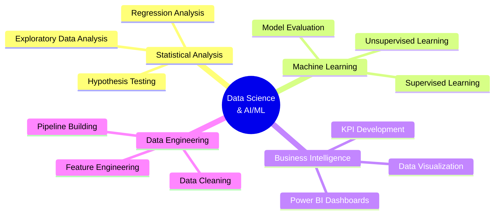

# Hi there! 👋 I'm Prashik Sawant

  

  

---

## 🚀 About Me

Driven Data Science & AI/ML Specialist with expertise in **statistical analysis**, **machine learning**, and **predictive modeling**. I transform raw data into actionable business insights and excel at building data pipelines, training models, and presenting complex findings in a clear, impactful manner.

- 🔭 I'm currently working on **Advanced ML Models & Data Pipelines**
- 🌱 I'm currently expanding into **Deep Learning & AI**
- 👯 I'm looking to collaborate on **Data Science & Machine Learning Projects**
- 💬 Ask me about **Python, SQL, Machine Learning, Data Analysis, Power BI**
- 📫 How to reach me: **prashiksawant@gmail.com**
- ⚡ Fun fact: **When I'm not diving into data, you'll find me playing chess!**
- 🎯 **Experience**: Analyzed **100,000+ rows** of data across multiple domains

---

## 🛠️ Tech Stack & Tools

### Programming Languages

### Data Science & ML Libraries

### Data Visualization & BI Tools

### Database & Tools

### Development & Version Control

---

## 📊 GitHub Analytics

  
  

  

  

---

## 🏆 GitHub Trophies

  

---

## 🎯 Featured Data Science Projects

---

## 📈 Key Achievements & Impact

| 🎯 **Metric** | 📊 **Achievement** |
|:---:|:---:|
| **Data Analyzed** | 100,000+ rows across multiple domains |
| **Inventory Inefficiencies Found** | 15+ through SQL analysis |
| **Decision-Making Speed Improvement** | 30% via interactive dashboards |
| **EV Sales Forecasting** | Projected through 2030 with CAGR models |
| **Data Quality Improvement** | 20% through advanced cleaning techniques |
| **KPIs Developed** | 8+ interactive dashboard metrics |

---

## 🔬 Domain Expertise

---

## 🎓 Education & Certifications

- 🎓 **Advanced Certificate in Data Science** - Comprehensive program covering ML, statistical analysis, and BI tools
- 🎓 **Bachelor of Engineering in Computer Science** - Strong foundation in programming and analytical thinking
- 📄 **Published Research**: OCR Integration and Searchable Encryption
- 🏆 **Smart Cities Mission**: Health supply chain analysis for Maharashtra

---

## 💼 Professional Experience Highlights

### 🔍 **Supply Chain Optimization**
- Analyzed 100,000+ rows using SQL to identify 15+ inventory inefficiencies
- Built interactive Excel dashboards improving decision-making by 30%

### 📊 **EV Market Analysis**
- Analyzed sales data across 10+ Indian states
- Developed CAGR forecasting models projecting through 2030
- Quantified FAME II policy impact (2M+ unit sales increase)

### 🏠 **Predictive Modeling**
- Built house rent prediction models using scikit-learn
- Developed credit risk assessment systems with customer segmentation

### 🏥 **Healthcare Analytics**
- Smart Health Case Study for Maharashtra under Smart Cities Mission
- Identified 4 key systemic issues from 500+ health records
- Delivered comprehensive reports with 10+ visualizations

---

## 💭 Random Data Science Quote

  

---

## 🐍 Contribution Snake

  

---

## 📫 Let's Connect!

I'm always interested in discussing new opportunities, data projects, or potential collaborations. Whether you're looking for a data scientist or want to explore insights from your data, I'd love to hear from you!

  
### Show some ❤️ by starring my repositories!

---

  

---

  <i>⭐️ From [PrashikSawant](https://github.com/PrashikSawant) - Transforming Data into Insights</i>

